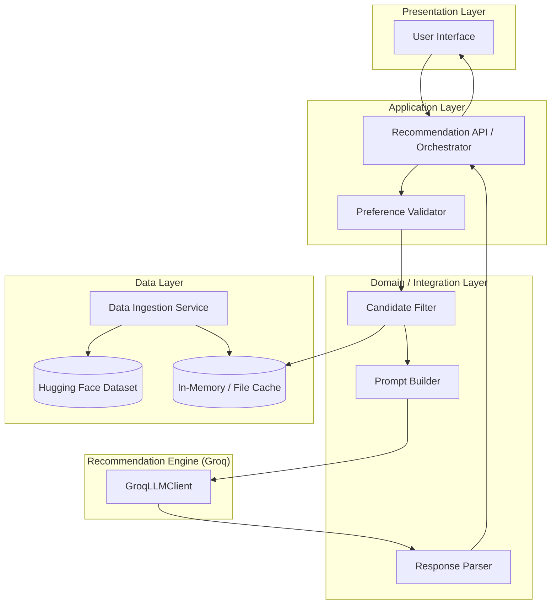
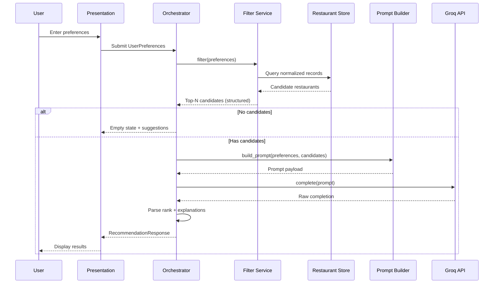
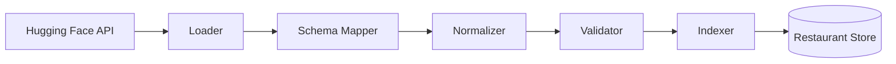
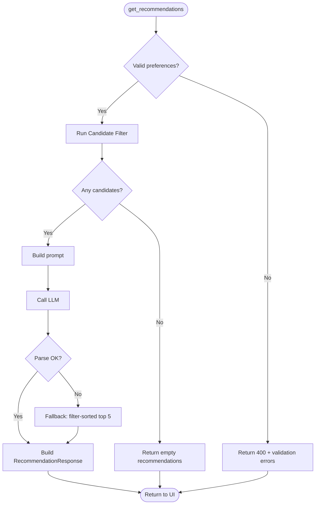
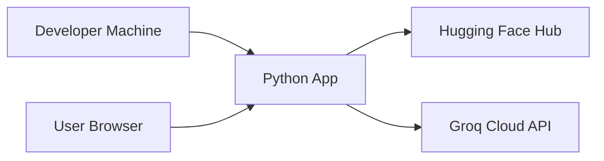

# System Architecture: AI-Powered Restaurant Recommendation System

> Derived from [Docs/context.md](context.md) and [Docs/problemStatement.txt](problemStatement.txt).  
> Zomato-inspired milestone for the Project Manager Fellowship.

---

## 1. Purpose and Scope

This document describes the **logical and physical architecture** for an application that:

1. Ingests restaurant data from the Hugging Face Zomato dataset
2. Collects structured user preferences
3. Filters candidates deterministically before LLM involvement
4. Uses an LLM to rank, explain, and optionally summarize recommendations
5. Presents results in a user-friendly format

**In scope:** data pipeline, preference model, filtering, LLM integration, presentation layer.  
**Out of scope (per context):** auth, user accounts, search history persistence, mandated tech stack—recommendations below are **suggested defaults** for implementation.

### LLM provider (Groq)

The **recommendation engine** (Phases 3–4) uses **[Groq](https://console.groq.com)** for fast chat-completions inference—not OpenAI. The `src/llm/client.py` adapter wraps the official **`groq`** Python SDK. Phase 4 orchestration calls this client by default; tests continue to use `MockLLMClient` without network access.

| Item | Value |
|------|--------|
| **SDK** | `groq` (`pip install groq`) |
| **API key env** | `GROQ_API_KEY` |
| **Model env** | `GROQ_MODEL` (e.g. `llama-3.3-70b-versatile`, `llama3-70b-8192`) |
| **Client class** | `GroqLLMClient` implementing `complete(system, user, config) -> str` |

---

## 2. Architectural Principles


| Principle                    | Rationale                                                                                                              |
| ---------------------------- | ---------------------------------------------------------------------------------------------------------------------- |
| **Grounded recommendations** | The LLM only ranks and explains restaurants already present in filtered dataset rows—never invent new venues.          |
| **Filter before generate**   | Structured filters shrink the candidate set; the LLM handles ranking and natural-language reasoning on a bounded list. |
| **Separation of concerns**   | Ingestion, filtering, LLM orchestration, and UI are distinct modules with clear interfaces.                            |
| **Inspectable pipeline**     | Each stage produces loggable inputs/outputs (preferences → filter count → prompt → parsed response).                   |
| **Graceful degradation**     | If the LLM fails, return filter-sorted results with a static fallback message.                                         |


---

## 3. High-Level Architecture

### 3.1 Layered View




### 3.2 End-to-End Request Flow




---

## 4. Component Architecture

### 4.1 Data Ingestion Service

**Responsibility:** Load, validate, normalize, and persist restaurant records from Hugging Face.


| Aspect      | Design                                                                                         |
| ----------- | ---------------------------------------------------------------------------------------------- |
| **Source**  | `ManikaSaini/zomato-restaurant-recommendation` via `datasets` (Python) or equivalent HF client |
| **Trigger** | On application startup (cold load) or explicit refresh command                                 |
| **Output**  | Normalized `Restaurant` entities in an in-process store or serialized cache (JSON/Parquet)     |


**Processing steps:**

1. **Download / load** — Fetch dataset split(s); handle network and version pinning.
2. **Schema mapping** — Map raw columns to internal fields: `name`, `location`, `cuisines[]`, `cost`, `rating`, plus optional metadata.
3. **Normalization** — Trim strings; standardize location names; parse cuisine lists; coerce rating to float; map cost to numeric range and **budget tier** (`low` | `medium` | `high`).
4. **Validation** — Drop or flag rows missing required fields; log counts.
5. **Indexing** — Build lookup structures for filter performance (by `location`, `cuisine`, `rating`, `budget_tier`).




### 4.2 Restaurant Store (Data Layer)

**Responsibility:** Single source of truth for queryable restaurant data during a session.


| Storage option               | When to use                                             |
| ---------------------------- | ------------------------------------------------------- |
| **In-memory list + indexes** | Prototype, small dataset, fastest iteration             |
| **Local Parquet/SQLite**     | Faster restarts without re-downloading HF               |
| **Embedded DB**              | If dataset grows or multiple filter dimensions need SQL |


**Interface (conceptual):**

```
get_all() -> List[Restaurant]
query(filters: FilterCriteria) -> List[Restaurant]
get_by_ids(ids: List[str]) -> List[Restaurant]
```

### 4.3 User Preference Model

**Responsibility:** Capture and validate everything the user supplies before filtering.


| Field                    | Type                          | Validation                                               |
| ------------------------ | ----------------------------- | -------------------------------------------------------- |
| `location`               | string                        | Required; match against known locations or fuzzy match   |
| `budget`                 | enum: `low`, `medium`, `high` | Required                                                 |
| `cuisine`                | string or list                | Optional; partial match on cuisine tags                  |
| `min_rating`             | float                         | Optional; default 0.0; range [0, 5]                      |
| `additional_preferences` | string or tags                | Optional free text (e.g. family-friendly, quick service) |


```typescript
// Conceptual schema (language-agnostic)
UserPreferences {
  location: string
  budget: "low" | "medium" | "high"
  cuisine?: string
  min_rating?: number
  additional_preferences?: string
}
```

### 4.4 Candidate Filter (Integration Layer)

**Responsibility:** Deterministic narrowing of the dataset—**no LLM** at this stage.

**Filter pipeline (order matters for performance):**

1. **Location** — Exact or case-insensitive match on city/area field.
2. **Budget tier** — Map user `budget` to cost ranges defined at ingestion (e.g. low = cost ≤ X).
3. **Cuisine** — Substring or token match on cuisine field(s).
4. **Minimum rating** — `rating >= min_rating`.
5. **Additional preferences** — Keyword match on available text fields if present; otherwise defer nuance to LLM prompt context only.

**Output:** Ordered list of `Restaurant` records (e.g. sort by rating desc, then cost asc), capped at **N** (recommended: 15–30) to respect LLM context limits.


| Parameter                   | Suggested value |
| --------------------------- | --------------- |
| `MAX_CANDIDATES_TO_LLM`     | 20              |
| `MIN_CANDIDATES_BEFORE_LLM` | 1               |


**Empty result handling:** Return structured empty response with message to relax location, budget, or rating constraints.

### 4.5 Prompt Builder (Integration Layer)

**Responsibility:** Assemble a structured, grounded prompt from `UserPreferences` + candidate list.

**Prompt structure:**

1. **System role** — Expert dining recommender; must only reference provided restaurants; output JSON or fixed markdown sections.
2. **User context** — Serialized preferences.
3. **Candidate block** — Numbered list with id, name, cuisine, rating, cost, location snippet.
4. **Task instructions** — Rank top K (e.g. 5); explain fit per preference; optional one-paragraph summary.
5. **Output contract** — Required fields: `rank`, `restaurant_id`, `explanation`; optional `summary`.

**Design constraints:**

- Include **restaurant IDs** so the parser can merge LLM output with structured data.
- Explicitly forbid inventing restaurants not in the candidate list.
- Keep token count under model limit (truncate candidate fields, not entire rows).

### 4.6 Recommendation Engine (LLM)

**Responsibility:** Rank, explain, and optionally summarize—**not** source new facts.


| Concern         | Approach                                                                               |
| --------------- | -------------------------------------------------------------------------------------- |
| **Provider**    | **Groq** via `groq` SDK (`GroqLLMClient`); `MockLLMClient` for unit tests              |
| **Pattern**     | Single Groq chat completion per request (MVP); optional retry with JSON repair         |
| **Temperature** | Low (0.2–0.5) for stable ranking; slightly higher only if explanations feel repetitive |
| **Grounding**   | Post-validate: every `restaurant_id` in response exists in candidate set               |


**Adapter interface:**

```
complete(system_prompt: string, user_prompt: string, config: LLMConfig) -> string
```

**Groq implementation sketch:**

```python
from groq import Groq

client = Groq(api_key=config.api_key)
response = client.chat.completions.create(
    model=config.model,  # e.g. GROQ_MODEL
    messages=[
        {"role": "system", "content": system_prompt},
        {"role": "user", "content": user_prompt},
    ],
    temperature=config.temperature,
)
return response.choices[0].message.content
```

**Fallback:** On timeout or parse failure, return top 5 filter-sorted restaurants with template explanation: *"Matched your filters for location, budget, and cuisine."*

### 4.7 Response Parser (Integration Layer)

**Responsibility:** Convert LLM output into typed `Recommendation` objects merged with store data.

**Steps:**

1. Extract JSON or structured sections from completion.
2. Validate schema and restaurant IDs.
3. Merge with `Restaurant` records for display fields (name, cuisine, rating, cost).
4. Attach `explanation` and optional `summary` from LLM.
5. Sort by `rank` ascending.

### 4.8 Presentation Layer

**Responsibility:** Collect preferences and render results per context requirements.

**Each recommendation card displays:**


| Field                    | Source              |
| ------------------------ | ------------------- |
| Restaurant name          | Dataset (via merge) |
| Cuisine                  | Dataset             |
| Rating                   | Dataset             |
| Estimated cost           | Dataset             |
| AI-generated explanation | LLM                 |


**UI patterns (choose one for MVP):**

- **Streamlit / Gradio** — Fast fellowship demo
- **Web app (React + API)** — Separates frontend and orchestrator
- **CLI** — Useful for testing pipeline without UI

**Screens / states:**

- Preference form (defaults, validation errors inline)
- Loading state during filter + LLM
- Results list + optional summary banner
- Empty state and error state (LLM failure with fallback list)

### 4.9 Orchestrator (Application Layer)

**Responsibility:** Coordinate the pipeline; single entry point for `get_recommendations(preferences)`. Uses **`GroqLLMClient`** for live requests unless a mock client is injected (tests).




---

## 5. Data Model

### 5.1 Core Entities

```
Restaurant {
  id: string              // stable internal id (row index or hash)
  name: string
  location: string        // city / area
  cuisines: string[]      // normalized tags
  cost: number            // numeric, currency-agnostic if not in dataset
  budget_tier: enum       // low | medium | high (derived at ingestion)
  rating: float
  raw_metadata?: object   // optional extra columns for keyword matching
}

UserPreferences { ... }  // see §4.3

Recommendation {
  rank: int
  restaurant: Restaurant
  explanation: string
}

RecommendationResponse {
  recommendations: Recommendation[]
  summary?: string
  metadata: {
    candidate_count: int
    filters_applied: object
    llm_used: boolean
    fallback_used: boolean
  }
}
```

### 5.2 Budget Tier Mapping (Ingestion)

Define once at startup from dataset cost distribution:


| Tier     | Rule (example)         |
| -------- | ---------------------- |
| `low`    | cost ≤ 33rd percentile |
| `medium` | 33rd < cost ≤ 66th     |
| `high`   | cost > 66th            |


Percentiles can be computed globally or per `location` if cost varies by city.

---

## 6. Suggested Project Structure

```
ZOMATO-MILESTONE/
├── Docs/
│   ├── context.md
│   ├── architecture.md
│   └── problemStatement.txt
├── src/
│   ├── data/
│   │   ├── ingestion.py      # HF load + normalize
│   │   ├── store.py          # Restaurant store + indexes
│   │   └── models.py         # Restaurant, UserPreferences
│   ├── filtering/
│   │   └── candidate_filter.py
│   ├── llm/
│   │   ├── client.py         # GroqLLMClient + MockLLMClient
│   │   ├── prompts.py        # Prompt templates
│   │   ├── parser.py         # Response parsing + validation
│   │   ├── fallback.py
│   │   └── recommend.py      # generate_recommendations()
│   ├── api/
│   │   └── orchestrator.py   # get_recommendations() — wires Groq by default
│   └── ui/
│       └── app.py            # Streamlit / Gradio / CLI entry
├── config/
│   └── settings.py           # API keys, MAX_CANDIDATES, model name
├── tests/
│   ├── test_filter.py
│   └── test_parser.py
├── requirements.txt
└── README.md
```

---

## 7. External Dependencies


| Dependency                  | Role                                                |
| --------------------------- | --------------------------------------------------- |
| **Hugging Face `datasets`** | Load `ManikaSaini/zomato-restaurant-recommendation` |
| **`groq`**                  | Groq Chat Completions API (recommendation engine)   |
| **pandas** (optional)       | Tabular preprocessing                               |
| **UI framework**            | Streamlit, Gradio, or web stack                     |


**Configuration (environment):**

- `HF_DATASET_ID` — dataset identifier
- `GROQ_API_KEY` — Groq API key; never committed; load from `.env`
- `GROQ_MODEL` — Groq model id (e.g. `llama-3.3-70b-versatile`)
- `GROQ_TIMEOUT_SECONDS` — request timeout (default 30)
- `GROQ_TEMPERATURE` — sampling temperature (default 0.3)
- `MAX_CANDIDATES_TO_LLM` — cap for prompt size
- `TOP_RECOMMENDATIONS` — max ranked items returned (default 5)

> **Note:** Legacy `LLM_API_KEY` / `LLM_MODEL` env names may be supported as fallbacks during migration, but **Groq vars are canonical** for Phase 4+.

---

## 8. Non-Functional Requirements


| Category          | Target                                                                   |
| ----------------- | ------------------------------------------------------------------------ |
| **Latency**       | Ingestion once at startup; user request dominated by LLM (2–15s typical) |
| **Reliability**   | Filter path works without LLM; fallback on LLM errors                    |
| **Scalability**   | Single-user / demo scale; dataset fits in memory                         |
| **Observability** | Log filter counts, prompt token estimate, LLM latency, parse success     |
| **Security**      | API keys in env only; no PII required for MVP                            |


---

## 9. Error Handling Matrix


| Failure                    | Behavior                                                  |
| -------------------------- | --------------------------------------------------------- |
| HF download fails          | Block startup with clear error; optional local cache path |
| Invalid user input         | 400-style validation message in UI                        |
| Zero filter matches        | Empty state + suggest relaxing constraints                |
| LLM timeout / rate limit   | Retry once; then fallback ranking                         |
| Malformed LLM JSON         | JSON repair prompt or regex extract; else fallback        |
| Hallucinated restaurant ID | Drop invalid entries; log warning                         |


---

## 10. Security and Compliance

- Store **Groq API keys** (`GROQ_API_KEY`) in environment variables or a secret manager—not in source control.
- Do not send user PII to the LLM unless required; preferences are dining-related only.
- Dataset is public on Hugging Face; document license/attribution in README if required by dataset card.

---

## 11. Testing Strategy


| Layer            | Test focus                                                 |
| ---------------- | ---------------------------------------------------------- |
| **Ingestion**    | Schema mapping, budget tier assignment, row counts         |
| **Filter**       | Location/budget/cuisine/rating combinations; empty results |
| **Prompt**       | Snapshot tests for prompt shape; token length bounds       |
| **Parser**       | Valid/invalid LLM JSON; ID grounding                       |
| **Orchestrator** | End-to-end with mocked LLM                                 |
| **UI**           | Manual test plan: happy path, empty, fallback              |


---

## 12. Deployment View (Optional MVP)




For a fellowship demo, **local run** (`streamlit run` or `python -m src.ui.app`) is sufficient. Containerization (Docker) and cloud deploy can follow without changing logical architecture.

---

## 13. Evolution Path (Post-MVP)


| Enhancement        | Architectural impact                                       |
| ------------------ | ---------------------------------------------------------- |
| Persistent cache   | Add `data/cache.parquet`; ingestion becomes incremental    |
| User accounts      | New auth service; store preference history                 |
| RAG on reviews     | Vector store + retrieval before LLM; larger context budget |
| Multi-turn chat    | Session state + conversation memory in orchestrator        |
| A/B ranking models | Replace or ensemble LLM with learned ranker                |


---

## 14. Traceability to Context


| Context section                                                  | Architecture section        |
| ---------------------------------------------------------------- | --------------------------- |
| Data Ingestion                                                   | §4.1, §4.2, §5              |
| User Input                                                       | §4.3, §4.8                  |
| Integration Layer                                                | §4.4, §4.5, §4.7            |
| Recommendation Engine                                            | §4.6                        |
| Output Display                                                   | §4.8, §5.1 `Recommendation` |
| Success criteria (grounded, personalized)                        | §2, §4.4–§4.7               |
| Glossary: Integration layer, Recommendation engine, Budget tiers | §4.4–§4.6, §5.2             |


---

## 15. References

- [Docs/context.md](context.md) — project context and workflow
- [Docs/problemStatement.txt](problemStatement.txt) — original requirements
- Dataset: [https://huggingface.co/datasets/ManikaSaini/zomato-restaurant-recommendation](https://huggingface.co/datasets/ManikaSaini/zomato-restaurant-recommendation)

