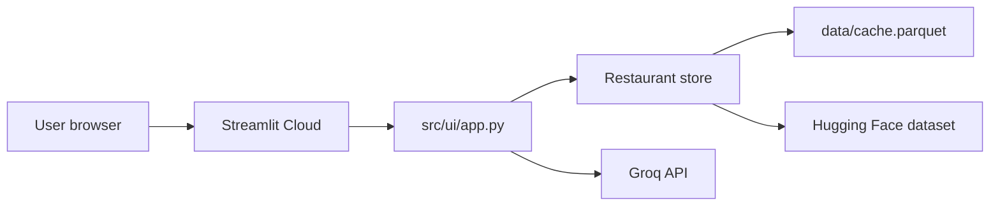

# Deployment Plan — Streamlit Community Cloud

> **Zomato AI Restaurant Recommendation System**  
> Deploy the Streamlit UI (`src/ui/app.py`) for fellowship demos and public sharing.

---

## Overview

| Item | Value |
|------|-------|
| **Target platform** | [Streamlit Community Cloud](https://streamlit.io/cloud) |
| **App entry point** | `streamlit_app.py` (Cloud default) or `src/ui/app.py` |
| **Python version** | 3.10+ (recommended: **3.12**, matches `Dockerfile`) |
| **Dependencies** | Root `requirements.txt` |
| **Required secret** | `GROQ_API_KEY` |
| **Optional secrets** | `GROQ_MODEL`, `HF_DATASET_ID`, `DATA_CACHE_PATH`, etc. |

This deployment covers the **Streamlit UI only**. The React frontend (`frontend/`) and FastAPI server (`src/api/server.py`) are separate and are **not** deployed by this plan.



---

## Prerequisites

Before deploying, confirm:

1. **GitHub repository** — code pushed to GitHub (public repo for free Community Cloud tier, or private with Streamlit Cloud access).
2. **Streamlit Cloud account** — sign in at [share.streamlit.io](https://share.streamlit.io) with GitHub.
3. **Groq API key** — create at [console.groq.com](https://console.groq.com) (free tier is sufficient for demos).
4. **Local smoke test passes**:

   ```bash
   pip install -r requirements.txt
   copy .env.example .env          # Windows
   # cp .env.example .env          # macOS/Linux
   # Add GROQ_API_KEY to .env
   streamlit run src/ui/app.py
   ```

5. **Tests pass** (no network):

   ```bash
   python -m pytest -v -m "not integration"
   ```

---

## Pre-deployment checklist

| Check | Action |
|-------|--------|
| No secrets in repo | `.env` is gitignored; only `.env.example` is committed |
| `requirements.txt` at repo root | Already present — Streamlit Cloud reads this automatically |
| Entry point path | Set to `src/ui/app.py` in Streamlit Cloud app settings |
| Dataset strategy | First deploy downloads ~574 MB from Hugging Face (see § Data & cold starts) |
| Demo location | Use **Bangalore** — dataset is Bangalore-centric (see README) |

---

## Step 1 — Push code to GitHub

1. Initialize git (if not already):

   ```bash
   git init
   git add .
   git commit -m "Initial commit — Zomato AI milestone"
   ```

2. Create a remote repository on GitHub and push:

   ```bash
   git remote add origin https://github.com/<your-username>/<your-repo>.git
   git branch -M main
   git push -u origin main
   ```

3. Verify these paths exist on the remote:
   - `requirements.txt`
   - `config/`
   - `src/`
   - `src/ui/app.py`

> **Do not commit** `.env`, `data/cache.parquet`, or `node_modules/`.

---

## Step 2 — Create the Streamlit Cloud app

1. Go to [share.streamlit.io](https://share.streamlit.io) → **Create app**.
2. Select:
   - **Repository:** your GitHub repo
   - **Branch:** `main` (or your default branch)
   - **Main file path:** `streamlit_app.py` (or `src/ui/app.py`)
3. Click **Advanced settings** (optional but recommended):
   - **Python version:** `3.12`
4. Click **Deploy**.

The first build installs dependencies from `requirements.txt` and starts Streamlit on port 8501.

---

## Step 3 — Configure secrets

Streamlit Cloud injects secrets as environment variables. The app loads them via `config/settings.py` (`python-dotenv` + `os.getenv`), so **no code changes are required** when secrets are set in the dashboard.

1. In Streamlit Cloud → your app → **Settings** → **Secrets**.
2. Add a TOML block:

   ```toml
   GROQ_API_KEY = "gsk_xxxxxxxxxxxxxxxx"
   GROQ_MODEL = "llama-3.3-70b-versatile"
   GROQ_TIMEOUT_SECONDS = 30
   GROQ_TEMPERATURE = 0.3
   MAX_CANDIDATES_TO_LLM = 20
   TOP_RECOMMENDATIONS = 5
   ```

3. Save secrets — the app redeploys automatically.

| Secret | Required | Default if omitted |
|--------|----------|------------------|
| `GROQ_API_KEY` | **Yes** (for AI ranking) | App shows warning; filter-only fallback may still run |
| `GROQ_MODEL` | No | `llama-3.3-70b-versatile` |
| `HF_DATASET_ID` | No | `ManikaSaini/zomato-restaurant-recommendation` |
| `DATA_CACHE_PATH` | No | `data/cache.parquet` |
| `FORCE_REFRESH` | No | `false` |

Reference: [.env.example](../.env.example)

---

## Step 4 — Data & cold starts

On first run, the app calls `load_restaurant_store()` (cached with `@st.cache_resource`):

1. If `data/cache.parquet` is missing, it downloads the Hugging Face dataset (~574 MB).
2. Normalizes and writes cache under `data/cache.parquet`.
3. Subsequent runs in the **same container session** reuse the in-memory store.

| Strategy | Pros | Cons |
|----------|------|------|
| **Default (HF download on first visit)** | No extra setup | Slow first load (2–5+ min); may hit memory limits |
| **Pre-built cache in repo** | Fast startup | Large repo; cache is gitignored by design |
| **Docker + volume mount** | Full control | Not Streamlit Cloud; see § Alternative: Docker |

**Recommendation for Streamlit Cloud:** Accept a slow first load, then rely on `@st.cache_resource` for the session. For fellowship demos, **open the deployed URL once before presenting** to warm the cache.

If the app crashes on startup due to memory, consider:
- Upgrading Streamlit Cloud plan (if available), or
- Using Docker on a VM with more RAM (see below).

---

## Step 5 — Post-deployment verification

Use the same scenarios as [phase5-ui-test-plan.md](phase5-ui-test-plan.md):

| # | Test | Expected |
|---|------|----------|
| 1 | Open deployed URL | Sidebar shows restaurant count after dataset load |
| 2 | Bangalore + Medium + North Indian → **Get recommendations** | Cards with name, cuisine, rating, cost, AI explanation |
| 3 | Invalid combo (e.g. French + rating 5.0) | Empty-state message, no crash |
| 4 | Missing/invalid Groq key | Clear error banner; graceful fallback where implemented |

**Demo script for evaluators:**

| Field | Value |
|-------|-------|
| Location | **Bangalore** (or **BTM**, **Banashankari**) |
| Budget | **medium** |
| Cuisine | **Italian** or **North Indian** |
| Min rating | **3.5** |

---

## Repository layout (what Streamlit Cloud needs)

```
ZOMATO-MILESTONE/
├── requirements.txt       ← pip install (required)
├── config/
│   └── settings.py        ← reads env / secrets
├── src/
│   ├── ui/app.py          ← main file path in Cloud settings
│   ├── api/orchestrator.py
│   ├── data/
│   ├── filtering/
│   └── llm/
└── data/                  ← created at runtime (cache.parquet)
```

No `packages.txt` is required unless you add system-level dependencies later.

---

## Optional — Streamlit config

For local parity with Cloud (wide layout, theme), add `.streamlit/config.toml` at the repo root:

```toml
[server]
headless = true
enableCORS = false
enableXsrfProtection = true

[browser]
gatherUsageStats = false

[theme]
base = "dark"
primaryColor = "#ff4a5f"
backgroundColor = "#07090d"
secondaryBackgroundColor = "#14151f"
textColor = "#f7e7e4"
```

Commit this file if you want consistent theming in Cloud and locally.

---

## Alternative — Docker (self-hosted)

If Streamlit Cloud limits (memory, cold start, or private networking) block you, use the included `Dockerfile`:

```bash
docker build -t zomato-ai .
docker run -p 8501:8501 \
  -e GROQ_API_KEY=your_key \
  -v ./data:/app/data \
  zomato-ai
```

Mount `./data` so `cache.parquet` persists across container restarts.

Deploy the container on any host that supports Docker (Railway, Render, Fly.io, AWS ECS, etc.) with port **8501** exposed.

---

## Troubleshooting

| Symptom | Likely cause | Fix |
|---------|--------------|-----|
| `ModuleNotFoundError: config` or `src` | Wrong working directory | Main file must be `src/ui/app.py`; app adds project root to `sys.path` |
| App stuck on “Loading restaurant dataset…” | HF download in progress or OOM | Wait; warm app before demo; check Cloud logs |
| `GROQ_API_KEY is not set` | Secret missing or typo | Add `GROQ_API_KEY` in Streamlit Secrets; redeploy |
| Groq 429 / rate limit | Free tier limits | Retry; reduce demo frequency; fallback ranking still applies |
| Empty recommendations | Filters too strict | Use Bangalore + medium + common cuisine |
| Build fails on `pip install` | Dependency conflict | Pin versions in `requirements.txt`; set Python 3.12 |

**Logs:** Streamlit Cloud → app → **Manage app** → **Logs**.

---

## Security notes

- Never commit `.env` or API keys (see [.gitignore](../.gitignore)).
- Rotate `GROQ_API_KEY` if exposed.
- Streamlit Secrets are encrypted at rest on Streamlit Cloud.
- Dataset usage is educational / fellowship milestone only — see README attribution.

---

## Rollback & updates

1. Push a fix to GitHub on the deployed branch.
2. Streamlit Cloud auto-rebuilds on each push.
3. To roll back: revert the commit on GitHub or redeploy from a previous commit in the Cloud UI.

---

## Success criteria

Deployment is complete when:

- [ ] Public (or team) URL loads without import errors
- [ ] Restaurant count appears in the sidebar
- [ ] Bangalore + medium + Italian returns ≥1 recommendation with Groq explanation
- [ ] `GROQ_API_KEY` is only in Streamlit Secrets, not in the repo
- [ ] Fellowship demo flow matches [phase6-delivery.md](phase6-delivery.md)

---

## Related docs

| Doc | Purpose |
|-----|---------|
| [README.md](../README.md) | Quick start & commands |
| [architecture.md](architecture.md) | System design |
| [phase5-ui-test-plan.md](phase5-ui-test-plan.md) | Manual UI tests |
| [phase6-delivery.md](phase6-delivery.md) | MVP checklist & demo script |
