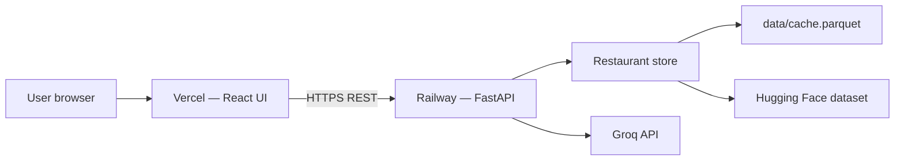

# Deployment Plan — Railway (Backend) + Vercel (Frontend)

> **Zomato AI Restaurant Recommendation System**  
> Deploy the **FastAPI backend** on [Railway](https://railway.app) and the **React + Vite frontend** on [Vercel](https://vercel.com).

---

## Overview

| Layer | Platform | Source | Public URL |
|-------|----------|--------|------------|
| **Backend API** | Railway | `src/api/server.py` | `https://<your-service>.up.railway.app` |
| **Frontend UI** | Vercel | `frontend/` (React + Vite) | `https://<your-app>.vercel.app` |

| Item | Value |
|------|-------|
| **Backend entry point** | `uvicorn src.api.server:app` |
| **Frontend entry point** | `frontend/src/App.tsx` (built to `frontend/dist/`) |
| **Python version** | 3.12 (recommended) |
| **Node version** | 20+ |
| **Required backend secret** | `GROQ_API_KEY` |
| **Required frontend env** | `VITE_API_BASE_URL` → Railway backend URL |

The **Streamlit UI** (`src/ui/app.py`) is optional for local demos only and is **not** part of this deployment path.



### API endpoints (backend)

| Method | Path | Purpose |
|--------|------|---------|
| `GET` | `/health` | Health check + restaurant count |
| `GET` | `/locations` | Cities and localities for the form |
| `POST` | `/recommendations` | Filter + Groq ranking |

---

## Prerequisites

Before deploying, confirm:

1. **GitHub repository** — code pushed (e.g. [prathammm16/ZOMATO-MILESTONE](https://github.com/prathammm16/ZOMATO-MILESTONE)).
2. **Railway account** — [railway.app](https://railway.app) (GitHub login).
3. **Vercel account** — [vercel.com](https://vercel.com) (GitHub login).
4. **Groq API key** — [console.groq.com](https://console.groq.com) (free tier works for demos).
5. **Local smoke test passes**:

   ```bash
   # Terminal 1 — backend
   pip install -r requirements.txt
   copy .env.example .env          # Windows
   # cp .env.example .env          # macOS/Linux
   # Add GROQ_API_KEY to .env
   uvicorn src.api.server:app --host 127.0.0.1 --port 8000 --reload

   # Terminal 2 — frontend
   cd frontend
   npm install
   set VITE_API_BASE_URL=http://127.0.0.1:8000   # Windows CMD
   # export VITE_API_BASE_URL=http://127.0.0.1:8000   # macOS/Linux
   npm run dev
   ```

6. **Tests pass** (no network):

   ```bash
   python -m pytest -v -m "not integration"
   ```

---

## Pre-deployment checklist

| Check | Action |
|-------|--------|
| No secrets in repo | `.env` is gitignored; only `.env.example` is committed |
| `requirements.txt` at repo root | Railway installs Python deps from here |
| Backend CORS | `src/api/server.py` allows all origins (`*`) — works with Vercel |
| Deploy backend **first** | Frontend needs the Railway URL for `VITE_API_BASE_URL` |
| Demo location | Use **Bangalore** — dataset is Bangalore-centric |
| First cold start | HF download ~574 MB on Railway startup (see § Data & cold starts) |

---

## Step 1 — Push code to GitHub

If not already done:

```bash
git remote add origin https://github.com/<your-username>/ZOMATO-MILESTONE.git
git branch -M main
git push -u origin main
```

Verify these paths exist on the remote:

- `requirements.txt`
- `config/`
- `src/api/server.py`
- `frontend/package.json`
- `frontend/src/App.tsx`

> **Do not commit** `.env`, `data/cache.parquet`, or `node_modules/`.

---

## Step 2 — Deploy backend on Railway

### 2.1 Create the service

1. Open [railway.app/new](https://railway.app/new) → **Deploy from GitHub repo**.
2. Select **`ZOMATO-MILESTONE`**.
3. Railway creates a service from the repo root (do **not** set root directory to `frontend/`).

### 2.2 Configure build & start

In the Railway service → **Settings**:

| Setting | Value |
|---------|-------|
| **Root Directory** | *(leave empty — repo root)* |
| **Start Command** | `python scripts/railway_start.py` |

Add a **variable** (or use Railway’s default):

| Variable | Value |
|----------|-------|
| `PYTHONPATH` | `.` |

Optional `railway.toml` at repo root (commit if you want config in git):

```toml
[build]
builder = "NIXPACKS"

[deploy]
startCommand = "python scripts/railway_start.py"
healthcheckPath = "/health"
healthcheckTimeout = 300
restartPolicyType = "ON_FAILURE"
```

### 2.3 Environment variables

In Railway → **Variables**, add:

| Variable | Required | Example / default |
|----------|----------|-------------------|
| `GROQ_API_KEY` | **Yes** | `gsk_xxxxxxxxxxxxxxxx` |
| `GROQ_MODEL` | No | `llama-3.3-70b-versatile` |
| `GROQ_TIMEOUT_SECONDS` | No | `30` |
| `GROQ_TEMPERATURE` | No | `0.3` |
| `HF_DATASET_ID` | No | `ManikaSaini/zomato-restaurant-recommendation` |
| `DATA_CACHE_PATH` | No | `data/cache.parquet` |
| `FORCE_REFRESH` | No | `false` |
| `MAX_CANDIDATES_TO_LLM` | No | `20` |
| `TOP_RECOMMENDATIONS` | No | `5` |
| `PYTHONPATH` | Yes | `.` |

Reference: [.env.example](../.env.example)

### 2.4 Generate public URL

1. Railway service → **Settings** → **Networking** → **Generate Domain**.
2. Copy the URL, e.g. `https://zomato-api-production.up.railway.app`.
3. Test:

   ```bash
   curl https://<your-railway-domain>/health
   ```

   Expected:

   ```json
   {"status":"ok","restaurants":40000}
   ```

   *(Restaurant count varies; `status: ok` confirms the API is live.)*

> **Note:** First deploy may take **2–5+ minutes** while the Hugging Face dataset downloads and the store loads on startup.

### 2.5 Optional — persist dataset cache on Railway

Without a volume, each redeploy re-downloads the dataset. To speed restarts:

1. Railway → service → **Volumes** → add a volume mounted at `/app/data`.
2. Set `DATA_CACHE_PATH=data/cache.parquet` (default).

---

## Step 3 — Deploy frontend on Vercel

Deploy **after** the Railway backend URL is known.

### 3.1 Import project

1. Open [vercel.com/new](https://vercel.com/new) → **Import** your GitHub repo.
2. Configure the project:

| Setting | Value |
|---------|-------|
| **Framework Preset** | Vite |
| **Root Directory** | `frontend` |
| **Build Command** | `npm run build` |
| **Output Directory** | `dist` |
| **Install Command** | `npm install` |

### 3.2 Environment variables

Add before the first production deploy:

| Variable | Value |
|----------|-------|
| `VITE_API_BASE_URL` | `https://<your-railway-domain>` *(no trailing slash)* |

Example:

```
VITE_API_BASE_URL=https://zomato-api-production.up.railway.app
```

> **Important:** Vite bakes `VITE_*` variables in at **build time**. If you change the Railway URL later, update this variable on Vercel and **redeploy** the frontend.

### 3.3 Deploy

Click **Deploy**. Vercel builds `frontend/` and serves static files from `dist/`.

Optional `frontend/vercel.json` for SPA routing (add if client-side routes are added later):

```json
{
  "rewrites": [{ "source": "/(.*)", "destination": "/index.html" }]
}
```

---

## Step 4 — Connect frontend to backend

End-to-end flow:

1. User opens the **Vercel URL**.
2. React app reads `import.meta.env.VITE_API_BASE_URL` (see `frontend/src/App.tsx`).
3. Browser calls Railway:
   - `GET /health` and `GET /locations` on load
   - `POST /recommendations` on form submit

**Deploy order:**

```text
GitHub push → Railway (backend) → copy Railway URL → Vercel env + deploy (frontend)
```

If the frontend shows network errors:

- Confirm `VITE_API_BASE_URL` matches the Railway domain exactly.
- Confirm Railway service is running (`/health` returns 200).
- Redeploy Vercel after any env change.

---

## Step 5 — Data & cold starts (Railway)

On startup, `src/api/server.py` loads the restaurant store:

1. If `data/cache.parquet` is missing → downloads from Hugging Face (~574 MB).
2. Normalizes and caches to `data/cache.parquet`.
3. Serves requests once `_get_store()` completes.

| Strategy | Pros | Cons |
|----------|------|------|
| **Default (download on deploy)** | No extra setup | Slow first deploy; needs enough RAM |
| **Railway volume on `/app/data`** | Cache survives redeploys | Small extra cost |
| **Pre-warm before demo** | Reliable fellowship demo | Manual step |

**Recommendation:** Hit `/health` once after deploy and wait until `restaurants` > 0 before sharing the Vercel link.

---

## Step 6 — Post-deployment verification

### Backend (Railway)

| # | Test | Expected |
|---|------|----------|
| 1 | `GET /health` | `{"status":"ok","restaurants":...}` |
| 2 | `GET /locations` | JSON with `cities` and `localities` arrays |
| 3 | `POST /recommendations` with Bangalore + medium + Italian | JSON with `recommendations` array |

Example:

```bash
curl -X POST https://<your-railway-domain>/recommendations \
  -H "Content-Type: application/json" \
  -d "{\"location\":\"Bangalore\",\"budget\":\"medium\",\"cuisine\":\"Italian\",\"min_rating\":3.5,\"num_recommendations\":3}"
```

### Frontend (Vercel)

| # | Test | Expected |
|---|------|----------|
| 1 | Open Vercel URL | Page loads; restaurant count in header/stats |
| 2 | Bangalore + Medium + North Indian → submit | Recommendation cards with AI explanations |
| 3 | Strict filters (French + rating 5.0) | Empty state, no crash |
| 4 | Browser DevTools → Network | Requests go to Railway domain, not `127.0.0.1` |

**Demo script for evaluators:**

| Field | Value |
|-------|-------|
| Location | **Bangalore** (or **BTM**, **Banashankari**) |
| Budget | **medium** |
| Cuisine | **Italian** or **North Indian** |
| Min rating | **3.5** |

---

## Repository layout

```
ZOMATO-MILESTONE/
├── requirements.txt          ← Railway: pip install
├── config/settings.py        ← reads env vars
├── src/api/server.py         ← FastAPI app (Railway)
├── src/api/orchestrator.py
├── src/data/                 ← ingestion + store
├── src/llm/                  ← Groq integration
├── frontend/
│   ├── package.json          ← Vercel: npm install
│   ├── vite.config.ts
│   ├── src/App.tsx           ← uses VITE_API_BASE_URL
│   └── dist/                 ← Vercel output (generated)
└── data/                     ← runtime cache (Railway volume optional)
```

---

## Local development (matches production)

```bash
# Backend
uvicorn src.api.server:app --host 127.0.0.1 --port 8000 --reload

# Frontend (separate terminal)
cd frontend
npm install
set VITE_API_BASE_URL=http://127.0.0.1:8000    # Windows CMD
npm run dev
```

Or use Makefile shortcuts: `make api-server`, `make react-vite`.

---

## Troubleshooting

| Symptom | Likely cause | Fix |
|---------|--------------|-----|
| Railway build fails | Missing `requirements.txt` or wrong root dir | Deploy from repo root, not `frontend/` |
| Railway crash on startup | OOM during HF download | Add volume; upgrade plan; wait and retry |
| `ModuleNotFoundError: src` | `PYTHONPATH` not set | Set `PYTHONPATH=.` on Railway |
| `'$PORT' is not a valid integer` | Shell did not expand `$PORT` | Use `python scripts/railway_start.py` as start command |
| Vercel UI loads but API errors | Wrong or missing `VITE_API_BASE_URL` | Set env to Railway URL; redeploy Vercel |
| CORS error in browser | Backend not reachable or wrong URL | Check Railway domain; CORS is `*` in server |
| Frontend calls `127.0.0.1:8000` in prod | `VITE_API_BASE_URL` not set at build | Add env on Vercel → **Redeploy** |
| `GROQ_API_KEY is not set` | Missing Railway variable | Add `GROQ_API_KEY` in Railway Variables |
| Groq 429 / rate limit | Free tier limits | Retry; fallback ranking still applies |
| Empty recommendations | Filters too strict | Use Bangalore + medium + common cuisine |
| `/health` timeout on first deploy | Dataset still loading | Wait 2–5 min; check Railway logs |

**Logs:**

- Railway → service → **Deployments** → **View Logs**
- Vercel → project → **Deployments** → **Build Logs** / **Runtime Logs**

---

## Security notes

- Never commit `.env` or API keys (see [.gitignore](../.gitignore)).
- Store `GROQ_API_KEY` only in **Railway Variables**, not in Vercel (frontend does not need it).
- Rotate `GROQ_API_KEY` if exposed.
- For production hardening, restrict CORS in `src/api/server.py` to your Vercel domain instead of `*`.
- Dataset usage is educational / fellowship milestone only — see README attribution.

---

## Rollback & updates

| Platform | How to update |
|----------|----------------|
| **Railway** | Push to GitHub → auto-redeploy; or rollback in Deployments tab |
| **Vercel** | Push to GitHub → auto-redeploy; or promote a previous deployment |

If the Railway URL changes, update `VITE_API_BASE_URL` on Vercel and redeploy the frontend.

---

## Success criteria

Deployment is complete when:

- [ ] Railway `/health` returns `status: ok` with restaurant count > 0
- [ ] Vercel app loads and shows live data from Railway (not localhost)
- [ ] Bangalore + medium + Italian returns ≥1 recommendation with Groq explanation
- [ ] `GROQ_API_KEY` exists only in Railway Variables, not in the repo
- [ ] Fellowship demo flow matches [phase6-delivery.md](phase6-delivery.md)

---

## Optional — Streamlit UI (local demo only)

The Streamlit app (`streamlit_app.py` / `src/ui/app.py`) remains available for local demos:

```bash
streamlit run streamlit_app.py
```

For Streamlit Community Cloud deployment, see `.streamlit/config.toml` and `.streamlit/secrets.toml.example`. That path is separate from Railway + Vercel.

---

## Related docs

| Doc | Purpose |
|-----|---------|
| [README.md](../README.md) | Quick start & commands |
| [architecture.md](architecture.md) | System design |
| [phase5-ui-test-plan.md](phase5-ui-test-plan.md) | Manual UI tests |
| [phase6-delivery.md](phase6-delivery.md) | MVP checklist & demo script |
