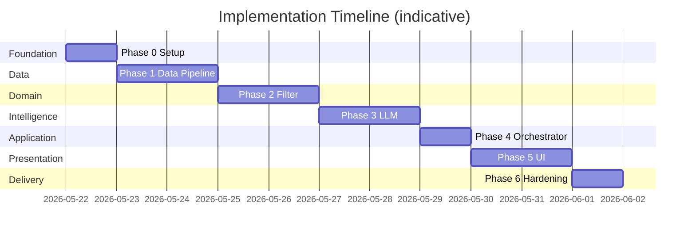
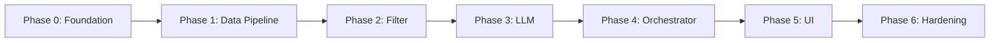

# Phase-Wise Implementation Plan

> **Zomato AI Restaurant Recommendation System**  
> Based on [Docs/context.md](context.md) and [Docs/architecture.md](architecture.md).

---

## Executive Summary

This plan delivers the full workflow from context—**ingest → preferences → filter → LLM → display**—in **six phases**. Each phase has clear deliverables, acceptance criteria, and dependencies. Phases are sequential; tasks within a phase can run in parallel where noted.

| Phase | Name | Primary outcome | Est. effort |
|-------|------|-----------------|-------------|
| **0** | Foundation & setup | Runnable repo, config, docs | 0.5–1 day |
| **1** | Data pipeline | Loaded, normalized restaurants in store | 1–2 days |
| **2** | Preferences & filtering | Deterministic candidates from user input | 1–2 days |
| **3** | LLM integration (Groq) | Ranked, explained recommendations via Groq API | 1–2 days |
| **4** | Orchestration (Groq) | Single `get_recommendations()` entry point wired to Groq | 0.5–1 day |
| **5** | UI & end-to-end demo | User-facing app meeting problem statement | 1–2 days |
| **6** | Hardening & delivery | Tests, fallbacks, README, demo-ready | 1 day |

**Total (MVP):** ~6–11 days depending on familiarity with Hugging Face and the Groq API.

**LLM provider:** [Groq](https://console.groq.com) (not OpenAI). Phases 3–4 use the `groq` SDK and `GROQ_API_KEY` / `GROQ_MODEL` environment variables.

---

| Context workflow step | Implemented in phase |
|----------------------|----------------------|
| 1. Data Ingestion | Phase 1 |
| 2. User Input | Phase 2 (model), Phase 5 (UI) |
| 3. Integration Layer | Phase 2 (filter), Phase 3 (prompt) |
| 4. Recommendation Engine | Phase 3 |
| 5. Output Display | Phase 5 |

---

## Phase 0: Foundation & Project Setup

**Goal:** Establish repository structure, dependencies, and configuration so later phases plug into a consistent layout (per architecture §6).

### Tasks

| # | Task | Owner hint | Output |
|---|------|------------|--------|
| 0.1 | Create folder structure: `src/data`, `src/filtering`, `src/llm`, `src/api`, `src/ui`, `config`, `tests` | Dev | Directories per architecture |
| 0.2 | Add `requirements.txt`: `datasets`, `pandas`, **`groq`**, UI (`streamlit` or `gradio`), `python-dotenv`, `pydantic` | Dev | Installable env |
| 0.3 | Add `config/settings.py`: `HF_DATASET_ID`, **`GROQ_API_KEY`**, **`GROQ_MODEL`**, `MAX_CANDIDATES_TO_LLM` (default 20) | Dev | Central config |
| 0.4 | Add `.env.example` and `.gitignore` (exclude `.env`, `__pycache__`, cache files) | Dev | Safe secrets handling |
| 0.5 | Scaffold `README.md`: how to install, set env, run app | Dev | Onboarding doc |
| 0.6 | Optional: `pytest` in dev dependencies | Dev | Test runner ready |

### Deliverables

- [ ] Repository matches suggested structure in architecture §6
- [ ] `pip install -r requirements.txt` succeeds
- [ ] Config loads from environment without hardcoded API keys

### Acceptance criteria

- Empty `src` imports resolve; `python -c "from config import settings"` works
- No secrets committed to git

### Architecture mapping

- §6 Suggested project structure  
- §7 External dependencies  
- §10 Security (env-based keys)

---

## Phase 1: Data Pipeline (Ingestion & Store)

**Goal:** Load the Hugging Face Zomato dataset, normalize fields, assign budget tiers, and expose a queryable in-memory store (architecture §4.1, §4.2, §5).

### Tasks

| # | Task | Details |
|---|------|---------|
| 1.1 | **Explore dataset** | Load `ManikaSaini/zomato-restaurant-recommendation`; document actual column names vs. expected (`name`, `location`, `cuisine`, `cost`, `rating`) |
| 1.2 | **Define models** | `src/data/models.py`: `Restaurant` dataclass/Pydantic model with `id`, `name`, `location`, `cuisines`, `cost`, `budget_tier`, `rating`, `raw_metadata` |
| 1.3 | **Implement ingestion** | `src/data/ingestion.py`: download/load → schema map → normalize (trim, parse cuisines, float rating/cost) |
| 1.4 | **Validation** | Drop or log rows missing `name`, `location`, or `rating`; print stats (loaded vs. kept) |
| 1.5 | **Budget tiers** | Compute cost percentiles (global or per location); assign `low` / `medium` / `high` (architecture §5.2) |
| 1.6 | **Restaurant store** | `src/data/store.py`: `get_all()`, `query(FilterCriteria)`, `get_by_ids()`; build indexes on `location`, `budget_tier`, cuisine tokens |
| 1.7 | **Startup loader** | Function `load_restaurant_store() -> RestaurantStore` called once at app init |
| 1.8 | **Optional cache** | Save normalized data to `data/cache.parquet` after first download; load cache on subsequent runs |
| 1.9 | **Unit tests** | `tests/test_ingestion.py`: row count > 0, budget tier distribution, required fields populated |

### Deliverables

- [ ] `Restaurant` and store interfaces implemented
- [ ] Dataset loads from Hugging Face (or cache) on startup
- [ ] Sample script prints 5 restaurants with all display fields

### Acceptance criteria

- At least one known city (e.g. Delhi or Bangalore) returns multiple restaurants via `get_all()` or location index
- Every stored restaurant has valid `budget_tier` and `rating`
- Ingestion logs: total rows, valid rows, dropped rows

### Risks & mitigations

| Risk | Mitigation |
|------|------------|
| Column names differ from docs | Task 1.1 mapping table in code comments |
| HF download slow/offline | Parquet cache (task 1.8); document manual download |
| Missing cost field | Derive tier from available price column or default `medium` |

### Context / architecture traceability

- Context: **Data Ingestion**, dataset URL, field extraction  
- Architecture: §4.1, §4.2, §5.1, §5.2

---

## Phase 2: User Preferences & Candidate Filter

**Goal:** Validate user input and return a bounded, sorted candidate list without calling the LLM (architecture §4.3, §4.4; context **Integration Layer** filtering half).

### Tasks

| # | Task | Details |
|---|------|---------|
| 2.1 | **UserPreferences model** | Extend `models.py`: `location`, `budget`, optional `cuisine`, `min_rating`, `additional_preferences` |
| 2.2 | **Validator** | `validate_preferences(prefs) -> (ok, errors)`; location non-empty; budget enum; `min_rating` in [0, 5] |
| 2.3 | **Location helper** | List distinct locations from store for UI dropdown; fuzzy/normalized match (case-insensitive) |
| 2.4 | **Candidate filter** | `src/filtering/candidate_filter.py`: pipeline order—location → budget_tier → cuisine → min_rating → optional keyword on metadata |
| 2.5 | **Sort & cap** | Sort by `rating` desc, `cost` asc; cap at `MAX_CANDIDATES_TO_LLM` |
| 2.6 | **Empty handling** | Return `FilterResult(candidates=[], message="Try relaxing…")` with actionable hint |
| 2.7 | **CLI smoke test** | Small script: stdin preferences → print candidate count and top 3 names (no LLM) |
| 2.8 | **Unit tests** | `tests/test_filter.py`: known location+budget returns results; impossible combo returns empty |

### Deliverables

- [ ] `filter(preferences, store) -> FilterResult` with candidates and metadata
- [ ] Validator rejects invalid budget/rating with clear messages

### Acceptance criteria

- Filter returns only restaurants matching location and budget tier
- Cuisine filter narrows results when provided
- `min_rating` excludes lower-rated venues
- Never returns more than `MAX_CANDIDATES_TO_LLM` items
- **No LLM calls** in this phase

### Parallel work

- Task 2.3 (location list) can proceed while 2.4 filter logic is built if store exists from Phase 1.

### Context / architecture traceability

- Context: **User Input** table, **Integration Layer** (filter)  
- Architecture: §4.3, §4.4, glossary (budget tiers, integration layer)

---

## Phase 3: LLM Integration (Prompt, Client, Parser) — Groq

**Goal:** Turn filtered candidates into ranked recommendations with explanations and optional summary using **Groq** (architecture §4.5–§4.7; context **Recommendation Engine**).

### Tasks

| # | Task | Details |
|---|------|---------|
| 3.1 | **Groq client adapter** | `src/llm/client.py`: `GroqLLMClient` with `complete(system, user, config) -> str` via `groq` SDK; read `GROQ_API_KEY` from settings; timeout (e.g. 30s); `MockLLMClient` for tests |
| 3.2 | **Prompt templates** | `src/llm/prompts.py`: system role, user preferences JSON, numbered candidates with `id`, instructions for top 5 rank + JSON output schema |
| 3.3 | **Output contract** | Document expected JSON: `[{ "rank", "restaurant_id", "explanation" }]` + optional `"summary"` |
| 3.4 | **Prompt builder** | `build_recommendation_prompt(preferences, candidates) -> str`; truncate long fields to control tokens |
| 3.5 | **Response parser** | `src/llm/parser.py`: extract JSON, validate IDs against candidate set, merge with `Restaurant` objects |
| 3.6 | **Hallucination guard** | Drop recommendations whose `restaurant_id` is not in candidate list; log warnings |
| 3.7 | **Fallback path** | `build_fallback_recommendations(candidates, preferences)`: top 5 filter-sorted + template explanation |
| 3.8 | **Integration test** | Script with `--mock` or live **Groq**: 5 candidates in → parsed `Recommendation` list out |
| 3.9 | **Unit tests** | `tests/test_parser.py`: valid JSON, malformed JSON, invalid IDs, empty list |

### Deliverables

- [ ] `recommend(preferences, candidates, store) -> list[Recommendation]` (or raw + parsed pair)
- [ ] Prompt forbids inventing restaurants (explicit in system message)
- [ ] Fallback function tested without API (unit test)

### Acceptance criteria

- LLM response produces at least 1 ranked item with non-empty `explanation` on happy path
- Explanations reference user-stated preferences (location, budget, cuisine) in manual review
- Parser rejects invalid `restaurant_id` values
- On forced parse failure, fallback returns 5 grounded results with `fallback_used=True` metadata

### Risks & mitigations

| Risk | Mitigation |
|------|------------|
| Non-JSON LLM output | Regex JSON extract; one retry with “JSON only” reminder; then fallback |
| Rate limits / cost | Low temperature; cap candidates; cache dataset not LLM |
| Groq API key missing | Clear error: set `GROQ_API_KEY` in `.env` (Phase 4/5 startup or first call) |
| Groq rate limits | Retry once; then fallback ranking |

### Context / architecture traceability

- Context: **Recommendation Engine** (rank, explain, summarize)  
- Architecture: §4.5, §4.6 (Groq), §4.7, §9 (LLM errors)

---

## Phase 4: Application Orchestration — Groq

**Goal:** Single coordinated pipeline—validate → filter → prompt → **Groq** → parse → response (architecture §4.9).

### Tasks

| # | Task | Details |
|---|------|---------|
| 4.1 | **RecommendationResponse model** | `recommendations`, optional `summary`, `metadata` (`candidate_count`, `filters_applied`, `llm_used`, `fallback_used`) |
| 4.2 | **Orchestrator** | `src/api/orchestrator.py`: `get_recommendations(preferences, store) -> RecommendationResponse`; default client **`GroqLLMClient`** |
| 4.3 | **Wire flow** | Validate → filter → if empty return empty response → else prompt → **Groq completion** → parse → on failure fallback |
| 4.4 | **Logging** | Log candidate count, Groq latency, parse success/fallback (architecture §8 observability) |
| 4.5 | **Unit test** | `MockLLMClient` only (no Groq network); assert full response shape and metadata flags |
| 4.6 | **CLI demo** | `python -m src.api.orchestrator` or similar; live demo requires `GROQ_API_KEY` |

### Deliverables

- [ ] `get_recommendations()` implements architecture §4.9 flowchart
- [ ] All branches covered: validation error, empty filter, success, fallback

### Acceptance criteria

- One function call from preferences to `RecommendationResponse`
- Empty filter does not call LLM
- Invalid preferences return errors without side effects
- Metadata accurately reflects `llm_used` and `fallback_used`
- Live path uses **Groq** (`GroqLLMClient`); tests inject `MockLLMClient`

### Context / architecture traceability

- Context: full **System Workflow** chain  
- Architecture: §3.2 sequence diagram, §4.9 (Groq orchestration)

---

## Phase 5: Presentation Layer (UI)

**Goal:** Collect preferences and display results per context **Output Display** (architecture §4.8).

### Tasks

| # | Task | Details |
|---|------|---------|
| 5.1 | **Choose UI** | Streamlit recommended for fellowship speed (architecture §4.8) |
| 5.2 | **Preference form** | Location dropdown (from store), budget select, cuisine text, min rating slider, additional preferences text |
| 5.3 | **Submit flow** | On submit: show spinner; call `get_recommendations()`; handle validation errors inline |
| 5.4 | **Results cards** | Per recommendation: name, cuisine, rating, estimated cost, AI explanation |
| 5.5 | **Summary banner** | Show optional LLM `summary` above results |
| 5.6 | **Empty state** | Message from filter when no candidates + tips to relax constraints |
| 5.7 | **Error / fallback state** | Badge if fallback used; still show list |
| 5.8 | **App entry** | `src/ui/app.py`: load store on startup (`@st.cache_resource` or equivalent) |
| 5.9 | **Manual test plan** | Document 3 scenarios: happy path, empty results, API failure → fallback |

### Deliverables

- [ ] Runnable UI: `streamlit run src/ui/app.py` (or documented equivalent)
- [ ] All five output fields visible on each card

### Acceptance criteria

- User can complete flow without touching code
- Loading state visible during LLM call
- Results match problem statement: name, cuisine, rating, cost, explanation
- App starts only after data store loads (or shows clear load error)

### Context / architecture traceability

- Context: **User Input**, **Output Display**  
- Architecture: §4.8

---

## Phase 6: Hardening, Testing & Delivery

**Goal:** Meet context **Success Criteria**; demo-ready artifact with docs and basic quality gates.

### Tasks

| # | Task | Details |
|---|------|---------|
| 6.1 | **Error matrix walkthrough** | Verify behaviors in architecture §9: HF fail, invalid input, zero matches, LLM timeout, bad JSON, bad IDs |
| 6.2 | **Test suite** | Run `pytest`; aim for green on ingestion, filter, parser, orchestrator (mocked LLM) |
| 6.3 | **README completion** | Install, `.env` setup, run UI, sample preferences, dataset attribution link |
| 6.4 | **Demo script** | 2-minute walkthrough: Delhi + medium budget + Italian → show top 3 explanations |
| 6.5 | **Code cleanup** | Remove debug prints; consistent logging; type hints on public functions |
| 6.6 | **Optional** | `Dockerfile` or `Makefile` for one-command run |
| 6.7 | **Final checklist** | See §Final MVP Checklist below |

### Deliverables

- [ ] Tests passing locally
- [ ] README sufficient for evaluator to run project
- [ ] Demo recorded or script prepared for fellowship presentation

### Acceptance criteria (maps to context success criteria)

| Success criterion (context) | Verification |
|----------------------------|----------------|
| End-to-end: ingest → preferences → filter → LLM → display | Manual demo + orchestrator test |
| Grounded in dataset, not hallucinated listings | Parser ID validation + manual spot-check |
| Personalized explanations | Review 3 LLM explanations against submitted prefs |
| Readable, actionable output | UI review with non-technical user if possible |

### Architecture mapping

- §8 NFRs, §11 Testing strategy, §12 Deployment view

---

## Final MVP Checklist

Use this before declaring the milestone complete:

- [x] Data loads from Hugging Face dataset (or documented cache)
- [x] User can set location, budget, cuisine, min rating, additional preferences
- [x] Filter runs before LLM; candidate count logged
- [x] Groq ranks and explains; optional summary shown
- [x] UI shows: name, cuisine, rating, cost, explanation
- [x] Fallback works when Groq fails
- [x] `GROQ_API_KEY` not in repository (only in `.env`)
- [x] `Docs/context.md`, `Docs/architecture.md`, and this plan remain accurate or updated

See [Docs/phase6-delivery.md](phase6-delivery.md) for error matrix and demo instructions.

---

## Suggested Task Board (Kanban)

| Backlog | In progress | Done |
|---------|-------------|------|
| Phase N+1 tasks | Current phase tasks | Completed phase deliverables |

**Rule:** Do not start Phase N+1 until Phase N acceptance criteria are met (except Phase 0 → 1 handoff).

---

## Per-Phase Testing Summary

| Phase | Automated tests | Manual verification |
|-------|-----------------|---------------------|
| 0 | — | Install + import config |
| 1 | `test_ingestion` | Print sample restaurants |
| 2 | `test_filter` | CLI filter smoke test |
| 3 | `test_parser` | One live Groq call with 5 candidates (optional) |
| 4 | `test_orchestrator` (mock Groq client) | CLI full pipeline |
| 5 | — | UI happy / empty / fallback paths |
| 6 | Full `pytest` | Demo script |

---

## Out of Scope (Defer Post-MVP)

Aligned with context and architecture §13:

- User authentication and saved history  
- Cloud deployment (unless fellowship requires)  
- RAG / vector search on reviews  
- Multi-turn conversational UI  
- Learned ranker replacing LLM  

---

## Document References

| Document | Role in planning |
|----------|------------------|
| [context.md](context.md) | What to build; workflow steps; success criteria |
| [architecture.md](architecture.md) | How to build; components, models, errors, structure |
| [problemStatement.txt](problemStatement.txt) | Original fellowship requirements |

**Dataset:** https://huggingface.co/datasets/ManikaSaini/zomato-restaurant-recommendation
